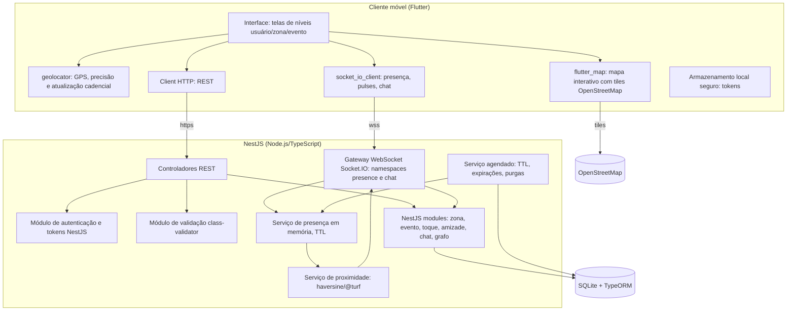
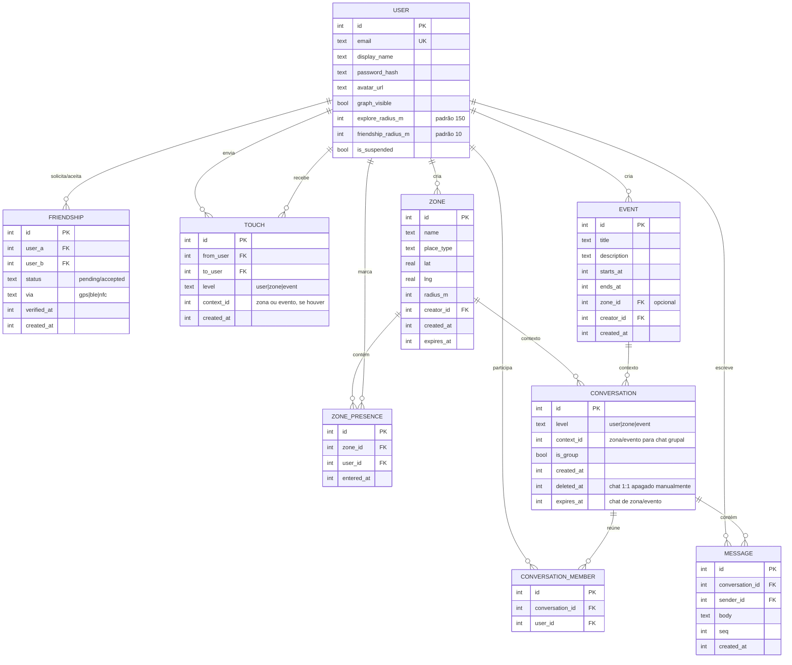
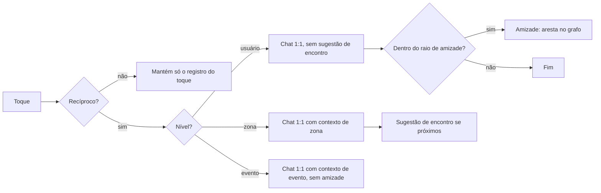
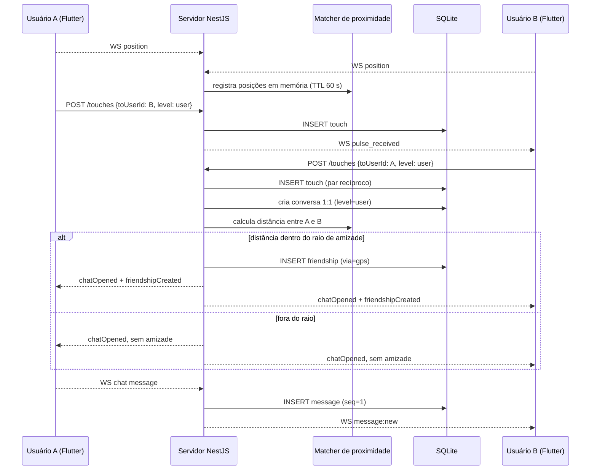
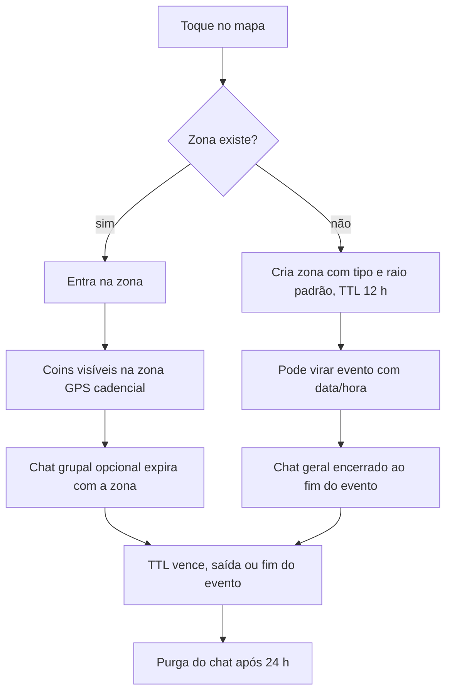

# ROTEIRO DE ORIENTAÇÃO — Monografia: rede social por proximidade

> **Eixo do trabalho:** uma rede social em que **conexão exige presença física**
> — a alternativa às redes atuais, que conectam digitalmente e afastam do
> encontro real.
>
> **Régua de orientação:** toda afirmação, em qualquer capítulo, deve ser verificável contra esse eixo. Sempre que um parágrafo falar de uma mecânica, ele precisa dizer em que nível ela acontece. Sempre que propuser um comportamento do sistema, ele precisa derivar do encontro físico.
>
> **Nome provisório do produto:** Signal.

---

## ELEMENTOS PRÉ-TEXTUAIS

### Capa / Folha de rosto / Ficha
- **O que demonstrar:** um título que diga o mecanismo (proximidade física) ou o contraste (a alternativa às redes que isolam). Não um título abstrato.
- `»SEMENTE` — título definitivo. Autores, instituição, orientador, ano.

### Resumo / Abstract
- **O que demonstrar:** em poucas linhas — o problema (as redes atuais conectam sem encontro), a proposta (conexão exige presença), as mecânicas (Explorar, toque mútuo, amizade 5–10m, grafo) e o que o trabalho entrega.
- **Pergunta que será feita:** o resumo permite a um leitor leigo entender a diferença para um Tinder ou para o Instagram? Se não, falta explicar o eixo.

---

## CAPÍTULO 1 — INTRODUÇÃO

    
### 1.1 Contextualização
- **O que demonstrar:** como as redes atuais funcionam — escala de uso, o modelo de atenção que as sustenta (feed, métricas, gamificação) — e por que esse modelo culmina em conexão sem encontro.
- **Perguntas que serão feitas:** as falas sobre "feed infinito" e "validação por métricas" estão ancoradas no *design* do produto, ou viraram crítica abstrata de plataformas? O leitor consegue reconhecer cada mecanismo citado em uma rede que ele usa?

Há quase exatamente três decádas atrás, acontecia o lançamento da primeira plataforma digital que teve como objetivo principal: permitir interações, comunicação e, criação de vínculos sociais entre pessoa, através do uso da internet, sendo responsável pela inscrição do conceito "rede social em nossa cultura. Denominada como Six Degrees, nome que fazia referência a teoria dos seis graus, que defendia que todas as pessoas estão conectadas, através de seis intermediários


### 1.2 Problema
- **O que demonstrar:** o problema não é "falta de rede social", é o modelo em que o vínculo digital não exige encontro. Frase que organiza o texto: a conexão digital substituiu o encontro; o produto propõe inverter isso.
- **Pergunta que será feita:** o problema está enunciado de modo que a proposta (proximidade) seja a resposta óbvia a ele?
- `»SEMENTE` — questão de pesquisa e hipótese em uma frase.

### 1.3 Hipótese
- **O que demonstrar:** conectar alguém a partir da presença física muda a natureza do vínculo (quem é visto de perto não é um nick); é possível desenhar a rede sem os mecanismos que isolam.
- **Pergunta que será feita:** a hipótese é falsificável? Dá para imaginar como ela seria negada pelos testes do Capítulo 6?

### 1.4 Objetivos
- **O que demonstrar:** um objetivo geral (desenhar/implementar a rede por proximidade) e específicos que fecham os capítulos: revisar o estado da arte (dark patterns, geo-social), definir os três níveis, especificar requisitos (incl. LGPD), desenhar arquitetura, testar caminhos críticos.
- **Pergunta que será feita:** o que a banca consegue *verificar* que foi feito? Cada objetivo específico corresponde a uma entrega concreta?
 `»SEMENTE` — protótipo funcional ou especificação.

### 1.5 Justificativa
- **O que demonstrar:** relevância social (efeito das redes atuais sobre o contato real), relevância técnica (proximidade como dado — GPS, BLE/NFC), relevância acadêmica (pouca literatura unindo design anti-dark-pattern a proximidade física).
- **Pergunta que será feita:** a justificativa deriva do modelo do produto, ou apela a um outro fator que o trabalho não demonstra?

### 1.6 Estrutura / 1.7 Metodologia
- **O que demonstrar:** como o trabalho foi construído — revisão da literatura, estudo de correlatos (geo-social, dating, apps de bairro) e prototipação — e como cada método alimenta um capítulo.
- `»SEMENTE` — validação técnica apenas, ou com usuários.

---

## CAPÍTULO 2 — REVISÃO DA LITERATURA

### 2.1 Design de redes sociais e dark patterns
- **O que demonstrar:** os mecanismos (feed, métricas, gamificação) e o que a literatura diz sobre eles. É aqui que se fundamenta a crítica ao modelo atual.
- **Perguntas que serão feitas:** cada mecanismo citado tem fonte? As fontes são citadas para o que realmente dizem?

### 2.2 Proximidade física e encontro
- **O que demonstrar:** por que o encontro presencial importa para o vínculo; o papel do lugar (praça, bar, evento) como contexto social.
- **Pergunta que será feita:** essa seção sustenta a régua do trabalho (conexão exige presença) ou contradiz a proposta em algum ponto?

### 2.3 Tecnologias de proximidade
- **O que demonstrar:** GPS (precisão ±5–20m), geofencing, BLE/NFC (5–10m), custo de bateria. Concluir com a base da decisão: 5–10m pede BLE/NFC; GPS é fallback.
- **Pergunta que será feita:** a decisão de "5–10m com GPS como fallback" nasce desta seção ou é só afirmação solta?

### 2.4 Aplicações correlatas
- **O que demonstrar:** o que já existe (geo-social, dating com raio, chats de bairro, apps de comunidade) e onde cada um fica aquém do eixo do trabalho.
- **Pergunta que será feita:** cada correlato é descrito no que faz, e a diferença para o produto é dita de forma verificável?

---

## CAPÍTULO 3 — DESCRIÇÃO DO PRODUTO

### 3.1 Conceito
- **O que demonstrar:** a rede em uma ideia: conexão exige presença física; ausência de feed infinito e de validação por métricas.
- **Pergunta que será feita:** um leitor que só leu esta seção consegue dizer o que o produto não é (não é dating, não é bairro privado, não é feed)?

### 3.2 Os três níveis de interação
- **O que demonstrar:**
  1. **Usuário** — relação direta: perfil, amizade, chat 1:1.
  2. **Ambiente/Zona** — o lugar vira contexto: mapa interativo daquela região, coins de quem está lá, chat grupal opcional.
  3. **Evento** — contexto com data/hora, chat geral opcional.
- **Pergunta que será feita:** a distinção entre os níveis está em propriedades do próprio produto (o que muda quando o contexto é um lugar?, quando é um evento?), e não em rótulos?

### 3.3 Matriz nível × interação
- **O que demonstrar (acordado):**

| Nível | Toque mútuo | Chat |
|-------|-------------|------|
| Usuário | toque abre chat 1:1 (mesmo longe); perto (5–10m) + toque → **amizade** (NFC/BT ideal, GPS fallback) | chat 1:1 efêmero (o usuário apaga manualmente) |
| Ambiente/Zona | toque abre chat; o chat **sugere encontro presencial** quando os dois estão próximos | chat grupal opcional, temporário |
| Evento | igual ao ambiente | chat geral opcional, temporário |

- **Regras que a matriz impõe:** amizade (aresta no grafo) só no nível usuário; chat grupal só em zona/evento; sugestão de encontro presencial só no chat que nasce de zona; o chat global não sugere encontro.
- **Pergunta que será feita:** algum caso de uso do Capítulo 3.5 fura alguma célula desta matriz?

### 3.4 Mecânicas
- **Explorar:** toggle de presença → coin no mapa para quem está no raio configurável; desativou, some.
- **Toque mútuo:** A toca o coin de B → o coin de A pulsa para B; B devolve → o coin de B pulsa para A; abre chat (regras da matriz 3.3).
- **Zona:** clicar num lugar no mapa → cria a zona (se ainda não existir) ou entra e sinaliza presença; raio por tipo de lugar; mapa interativo da região com os coins; chat grupal opcional; zona e chat temporários.
- **Amizade:** no nível usuário, exige 5–10m e confirmação mútua; gera aresta no grafo; NFC/BT no futuro, GPS fallback.
- **Grafo:** visualização da rede de amigos (nós = pessoas, arestas = amizades) + interações; editável e ocultável; filtro de amigos em comum.
- **Perguntas que serão feitas:** o que exatamente "temporário" significa em cada nível (zona vs. chat 1:1)? Como o produto justifica, pela régua, o porquê de a amizade só nascer no nível usuário?
- `»SEMENTE` — tabela de raios por tipo de lugar.

### 3.5 Casos de uso
- **O que demonstrar:** ativar Explorar; tocar coin; devolver toque; criar/entrar em zona; chat grupal opcional de zona/evento; adicionar amigo a 5–10m; ver/editar/ocultar grafo; ver amigos em comum; apagar chat.
- **Pergunta que será feita:** cada caso de uso declara o nível em que acontece?

### 3.6 Escopo / premissas / restrições · 3.7 Riscos
- **O que demonstrar:** o que o trabalho cobre e o que não cobre (moderação em escala, notificações push, aquisição de usuários); premissas (dispositivo com GPS, ativação consciente da localização, LGPD); riscos do próprio produto (cold start, raio vazio, bateria, assédio, privacidade) com mitigações correspondentes.
- **Pergunta que será feita:** os riscos listados são deste domínio (falta de gente perto, fronteira do raio, bateria) ou riscos genéricos de qualquer app?

---

# CAPÍTULO 4 — REQUISITOS

## 4.1 Metodologia de Elicitação

Os requisitos do Signal foram elicitados a partir de três fontes, coerentes com a metodologia do Capítulo 1. A primeira é a revisão da literatura: a crítica ao modelo de atenção das redes atuais (feed, métricas e gamificação), documentada pela literatura de dark patterns, origina os requisitos de ausência de feed infinito, de métricas públicas e de gamificação. A segunda é o estudo das aplicações correlatas — geo-social, *dating* por raio, chats de bairro e aplicativos de comunidade —, que delimita o que o produto não é. A terceira é a régua do domínio: a matriz nível × interação (seção 3.3) opera como invariante, e todo requisito é aceito somente se respeitar uma célula da matriz. A Lei Geral de Proteção de Dados (Lei nº 13.709/2018) define as restrições sobre o tratamento de dados de localização, impondo consentimento por finalidade, minimização e direito de exclusão.

A priorização adota a escala: **Essencial (E)** — indispensável ao MVP; **Importante (I)** — agrega valor; **Desejável (D)** — melhoria sem prejuízo do MVP. Cada requisito funcional declara o nível em que ocorre, identificado pelo prefixo **U** (usuário), **A** (ambiente/zona), **E** (evento) ou **T** (transversal).

## 4.2 Requisitos de Negócio (RN)

| Código | Requisito de negócio |
|--------|----------------------|
| RN01 | A conexão social deve exigir presença física: nenhum vínculo estrutural (amizade/aresta) pode ser criado à distância |
| RN02 | O sistema não deve reproduzir os mecanismos de captura de atenção das redes atuais: sem feed infinito, sem métricas públicas de validação, sem gamificação de atenção |
| RN03 | A interação deve ser organizada em três níveis (usuário, ambiente/zona, evento), respeitando a matriz nível × interação |
| RN04 | A amizade só pode nascer no nível usuário, exigindo proximidade física verificada e confirmação mútua |
| RN05 | O sistema deve tratar os dados pessoais, em especial os de localização, conforme a LGPD |
| RN06 | O grafo de amizade deve ser editável e ocultável |

## 4.3 Requisitos Funcionais (RF)

### 4.3.1 Nível Usuário

| Código | Requisito | Prio. |
|--------|-----------|-------|
| RF-U01 | Cadastro, login e logout com e-mail e senha | E |
| RF-U02 | Perfil mínimo: nome de exibição, avatar opcional e configurações de privacidade | E |
| RF-U03 | Ativar e desativar o Explorar (sinal de presença visível) | E |
| RF-U04 | Exibir como coin no mapa somente usuários com Explorar ativo dentro do raio configurado | E |
| RF-U05 | Raio de Explorar configurável entre 10 m e 2 km, com padrão de 150 m | E |
| RF-U06 | Tocar no coin de outro usuário no nível usuário | E |
| RF-U07 | Um toque isolado não abre chat; apenas o toque mútuo abre conversa | E |
| RF-U08 | O toque mútuo abre chat 1:1 mesmo à distância | E |
| RF-U09 | A amizade é criada somente com toque mútuo e proximidade verificada (5–10 m nominal, com tolerância de GPS) | E |
| RF-U10 | A amizade gera aresta no grafo com data, hora e método de verificação | E |
| RF-U11 | O chat 1:1 é apagado manualmente pelo usuário, com purga das mensagens após 48 h | E |
| RF-U12 | O chat 1:1, inclusive o aberto à distância, não sugere encontro presencial | E |
| RF-U13 | Bloquear e desbloquear um usuário | E |
| RF-U14 | Denunciar um usuário ou zona | E |
| RF-U15 | Visualizar o grafo de amizades (nós e arestas) | I |
| RF-U16 | Remover uma aresta do grafo (desfazer amizade) | I |
| RF-U17 | Ocultar o próprio grafo de terceiros | I |
| RF-U18 | Filtrar amigos em comum entre dois usuários | D |

### 4.3.2 Nível Ambiente / Zona

| Código | Requisito | Prio. |
|--------|-----------|-------|
| RF-A01 | Criar uma zona ao tocar num ponto do mapa; se a zona do tipo e local já existir, entrar nela | E |
| RF-A02 | Zona com tipo de lugar e raio padrão por tipo, configurável entre 10 m e 2 km | E |
| RF-A03 | Entrar numa zona registra a presença do usuário naquela região | E |
| RF-A04 | Mapa interativo da região com os coins dos usuários dentro da zona | E |
| RF-A05 | O toque mútuo no contexto de zona abre chat 1:1 com contexto da zona | E |
| RF-A06 | O chat nascido de zona sugere encontro presencial quando os dois estão próximos | E |
| RF-A07 | Chat grupal opcional da zona | I |
| RF-A08 | Zona e chat de zona temporários, com expiração por TTL (12 h) renovado por presença | E |
| RF-A09 | Sair da zona remove a presença e o coin do usuário | E |

### 4.3.3 Nível Evento

| Código | Requisito | Prio. |
|--------|-----------|-------|
| RF-E01 | Criar um evento (título, descrição, data/hora, local), opcionalmente vinculado a uma zona | E |
| RF-E02 | Entrar num evento e sinalizar presença | E |
| RF-E03 | Chat geral opcional do evento, temporário | I |
| RF-E04 | O toque mútuo em contexto de evento segue as regras de zona: abre chat e não gera amizade | E |
| RF-E05 | Ao encerrar o evento, o chat geral é encerrado e purgado após 24 h | E |
| RF-E06 | Listar eventos próximos por data e localização | D |

### 4.3.4 Transversais

| Código | Requisito | Prio. |
|--------|-----------|-------|
| RF-T01 | Entrega de presença, pulses e mensagens em tempo real por WebSocket | E |
| RF-T02 | Entrega de toques/pulses em tempo real ao destinatário | E |
| RF-T03 | Coordenadas processadas apenas em memória e descartadas; nenhuma posição persistida em disco | E |
| RF-T04 | Heartbeat de presença com expiração automática (TTL de 60 s) | E |
| RF-T05 | Limite de taxa para toques, mensagens e denúncias | E |
| RF-T06 | Exportação dos dados pessoais do usuário | D |
| RF-T07 | Exclusão da conta e de todos os dados pessoais associados | E |
| RF-T08 | Validação de toda a entrada de dados no servidor | E |

## 4.4 Requisitos Não-Funcionais (RNF)

| Código | Requisito | Parâmetro de aceitação |
|--------|-----------|------------------------|
| RNF01 | Precisão da proximidade | Amizade com distância nominal de 5–10 m; com GPS a verificação aceita erro limitado pela precisão reportada, com teto de 30 m; BLE/NFC previsto como regra exata |
| RNF02 | Consumo de bateria | Explorar ativo em primeiro plano: posição a cada 15 s; em segundo plano: 60 s ou geofencing; sem atualização com Explorar desativado |
| RNF03 | Latência em tempo real | Mensagens e pulses em menos de 1 s em rede local; heartbeat a cada 30 s com jitter de 0–5 s |
| RNF04 | Privacidade de localização | Coordenadas somente em memória, com TTL de 60 s; fim do Explorar ou desconexão apaga o registro; nenhuma posição em banco |
| RNF05 | LGPD: finalidade e minimização | Consentimento por finalidade na ativação do Explorar; coleta de e-mail, nome de exibição e posição transitória |
| RNF06 | LGPD: direitos do titular | Acesso, correção, exportação e eliminação dos dados; purga completa em até 48 h após a exclusão da conta |
| RNF07 | Segurança de trânsito e repouso | TLS/WSS em produção; senha com hash forte; token de acesso de 15 min e de renovação de 7 dias em armazenamento seguro do dispositivo |
| RNF08 | Anti-spam e anti-abuso | 30 toques/min por usuário e 1 toque por destinatário a cada 10 s; 20 mensagens/min por conversa e 500 caracteres por mensagem |
| RNF09 | Anti-spoofing | Velocidade implícita acima de 29 m/s entre posições consecutivas rejeitada; posição com precisão reportada acima de 50 m descartada |
| RNF10 | Confiabilidade | Reconexão automática do WebSocket com backoff exponencial; mensagens com número de sequência |
| RNF11 | Retenção de dados | Chat 1:1 purga 48 h após exclusão manual; chat de zona/evento purga 24 h após o fim do contexto; job de limpeza diário |
| RNF12 | Manutenibilidade | Cliente em Flutter (Dart); servidor em Node.js/TypeScript (NestJS); testes automatizados nos caminhos críticos |
| RNF13 | Portabilidade da demonstração | Servidor iniciado com um comando; cliente executado em emulador ou dispositivo físico |
| RNF14 | Acessibilidade | Contraste adequado, leitura por tela e área de toque mínima de 44 dp nos elementos interativos |
| RNF15 | Escalabilidade do MVP | Até 500 presenças ativas por região em memória sem degradação perceptível; listagens paginadas por cursor |
| RNF16 | Consistência da matriz | Regras da matriz verificadas no servidor e cobertas por teste |

## 4.5 Matriz de Rastreabilidade

| Requisito | Caso de uso / origem | Requisito de negócio |
|-----------|----------------------|----------------------|
| RF-U01–RF-U02 | Perfil | RN02, RN05 |
| RF-U03–RF-U05 | Explorar | RN01, RN03 |
| RF-U06–RF-U12 | Toque e chat 1:1 | RN01, RN03, RN04 |
| RF-U13–RF-U14 | Bloqueio e denúncia | RN05 |
| RF-U15–RF-U18 | Grafo | RN04, RN06 |
| RF-A01–RF-A09 | Zona | RN01, RN03 |
| RF-E01–RF-E06 | Evento | RN01, RN03 |
| RF-T01–RF-T05 | Tempo real, abuso | RN01, RN05 |
| RF-T06–RF-T08 | LGPD, validação | RN05 |
| RNF01–RNF16 | — | RN01, RN04, RN05 |

---

# CAPÍTULO 5 — PROJETO DE SOFTWARE

## 5.1 Arquitetura

O Signal é composto por um cliente móvel desenvolvido em Flutter e um servidor em Node.js/TypeScript construído com o framework NestJS. A comunicação entre eles ocorre por REST (HTTP), para as operações de escrita e consulta, e por WebSocket (protocolo Socket.IO, com o *adapter* do Socket.IO suportado nativamente pelo Node), para presença, pulses e mensagens em tempo real. O servidor mantém um registro em memória das posições ativas — sem persistir coordenadas em disco — a partir do qual calcula a proximidade entre usuários e decide quando dois usuários estão juntos.

### 5.1.1 Diagrama de Componentes



### 5.1.2 Fluxos de Dados

A **presença** funciona no modelo push cadencial. Ao ativar o Explorar, o cliente começa a reportar posição em intervalos definidos (RNF02). O servidor atualiza o registro em memória do usuário `{user_id, lat, lng, accuracy, updated_at}` e calcula o *diff* de coins para cada cliente afetado. Ao desativar o Explorar, ao desconectar ou ao expirar o TTL, o registro é removido.

O **toque** é um POST persistido na tabela `touch` com o nível e o contexto. O servidor notifica o destinatário por WebSocket. Quando existem dois toques recíprocos, o servidor cria a conversa 1:1 conforme o nível. Se, no nível usuário, houver também proximidade verificada, cria a aresta de amizade.

As **mensagens** são enviadas por POST, validadas, persistidas com número de sequência e reencaminhadas por WebSocket aos membros da conversa.

A **sugestão de encontro** é disparada apenas em conversas nascidas de zona: a cada posição recebida, o servidor calcula a distância entre os dois interlocutores e, abaixo de 150 m, injeta uma mensagem de sistema "Vocês parecem próximos — que tal um encontro presencial?", no máximo uma vez por conversa a cada 6 horas. Conversas 1:1 do nível usuário nunca recebem essa sugestão.

O **grafo** é derivado das tabelas `user` e `friendship`, com as interações (toques) como metadado de aresta. Remover aresta desfaz a amizade; ocultar o grafo suprime o nó do usuário na visualização de terceiros.

## 5.2 Modelo de Dados

A persistência utiliza TypeORM sobre SQLite no protótipo (driver `better-sqlite3`), com migrações gerenciadas pelo próprio TypeORM; o mesmo mapeamento é portável para PostgreSQL/PostGIS em produção, para o qual o TypeORM oferece tipos espaciais nativos. O banco armazena apenas os dados sociais duráveis; a posição não é uma entidade e não é gravada.

### 5.2.1 Entidades



### 5.2.2 Regras da Matriz no Modelo

A matriz nível × interação é expressa como regra de dado:

- **Amizade só no nível usuário:** a tabela `friendship` não contém referência a zona ou evento; a aresta é criada exclusivamente pelo serviço de amizade, que exige toque mútuo e verificação de proximidade pelo matcher (RF-U09, RF-U10).
- **Chat grupal só em zona/evento:** a coluna `level` da conversa restringe `is_group` a `zone` ou `event`, garantido por `CHECK (NOT (level = 'user' AND is_group = 1))`.
- **Chat de zona/evento temporário:** a coluna `expires_at` é preenchida no fim do contexto; o job de limpeza purga as mensagens após a janela (RF-A08, RF-E05).
- **Chat 1:1 apagado pelo usuário:** a coluna `deleted_at` marca a exclusão manual e dispara a purga em 48 h (RF-U11).
- **Pares únicos de aresta:** `UNIQUE (user_a, user_b)` em `friendship`.
- **Zona expirada:** `expires_at` inicia com TTL de 12 h e é renovado a cada presença; o job remove zonas expiradas e o chat grupal associado.

## 5.3 API e Contratos

### 5.3.1 Endpoints REST

Todas as rotas exigem token de acesso no cabeçalho de autorização, exceto registro, login e renovação. A entrada é validada no servidor com DTOs e *decorators* `class-validator` (RF-T08).

| Método | Rota | Função | Nível |
|--------|------|--------|-------|
| POST | `/auth/register` | Criar conta | — |
| POST | `/auth/login` | Autenticar e emitir tokens | — |
| POST | `/auth/refresh` | Renovar o token de acesso | — |
| GET | `/me` | Perfil do usuário logado | U |
| PATCH | `/me/profile` | Atualizar nome, avatar e privacidade | U |
| POST | `/me/explore/activate` | Ativar o Explorar | U |
| POST | `/me/explore/deactivate` | Desativar o Explorar | U |
| PATCH | `/me/explore/radius` | Configurar raio de Explorar | U |
| POST | `/touches` | Tocar o coin de outro usuário | U/A/E |
| GET | `/touches/received` | Pulses pendentes | U/A/E |
| GET | `/friendships` | Listar amizades | U |
| GET | `/friendships/common` | Amigos em comum | U |
| DELETE | `/friendships/{id}` | Remover aresta | U |
| GET | `/graph` | Grafo do usuário | U |
| GET | `/zones/around` | Zonas próximas | A |
| POST | `/zones` | Criar zona | A |
| GET | `/zones/{id}` | Detalhe da zona e coins | A |
| POST | `/zones/{id}/join` | Entrar na zona | A |
| POST | `/zones/{id}/leave` | Sair da zona | A |
| POST | `/zones/{id}/chat` | Habilitar chat grupal | A |
| GET | `/events` | Listar eventos próximos | E |
| POST | `/events` | Criar evento | E |
| GET | `/events/{id}` | Detalhe do evento | E |
| POST | `/events/{id}/join` | Entrar no evento | E |
| POST | `/events/{id}/chat` | Habilitar chat geral | E |
| GET | `/conversations` | Listar conversas | U/A/E |
| GET | `/conversations/{id}/messages` | Histórico paginado por cursor | U/A/E |
| POST | `/conversations/{id}/messages` | Enviar mensagem | U/A/E |
| DELETE | `/conversations/{id}` | Apagar chat 1:1 | U |
| POST | `/blocks` | Bloquear usuário | U |
| POST | `/reports` | Denunciar usuário ou zona | U |
| GET | `/me/data` | Exportar dados pessoais | T |
| DELETE | `/me` | Excluir conta e dados | T |

### 5.3.2 Canais WebSocket (Socket.IO via Gateway NestJS)

| Evento | Direção | Payload | Uso |
|--------|---------|---------|-----|
| `presence/position` | C→S | `{lat, lng, accuracy}` | Atualização cadencial | 
| `presence/coins` | S→C | `[{coinId, lat, lng, avatar}]` | Diff de coins visíveis |
| `presence/pulse_received` | S→C | `{fromUserId, level, contextId}` | Toque recebido |
| `presence/heartbeat` | C↔S | `{}` | Renovação do TTL |
| `chat/message:new` | S→C | `{conversationId, seq, senderId, body}` | Entrega de mensagem |
| `chat/suggestion` | S→C | `{conversationId, body}` | Sugestão de encontro |

### 5.3.3 Exemplos de Contratos

```json
// POST /touches — corpo
{ "toUserId": "u_9f2a", "level": "zone", "contextId": "z_41" }

// Resposta 201 — toque persistido, ainda sem recíproco
{ "ok": true, "touchId": 881, "reciprocal": false,
  "chatOpened": false, "friendshipCreated": false }

// Resposta 201 — havia toque recíproco e o par está próximo
{ "ok": true, "touchId": 882, "reciprocal": true,
  "chatOpened": true, "conversationId": 1203,
  "friendshipCreated": true }
```

```json
// POST /zones — corpo (validado por DTO com class-validator)
{
  "name": "Praça da Matriz",
  "placeType": "square",
  "lat": -21.2911,
  "lng": -50.3403
}
// Resposta 201 — raio assumido pelo tipo de lugar
{ "id": "z_41", "name": "Praça da Matriz", "radius_m": 100,
  "expiresAt": "2026-09-20T18:30:00Z", "created": true }
```

## 5.4 Geolocalização

### 5.4.1 Hierarquia de Consumo de Bateria

O consumo de localização segue uma escada de granularidade, em que o nível fino só é ativado quando necessário:

1. **Geofencing (nível grosso):** fora de qualquer zona, o sistema monitora apenas as fronteiras das zonas conhecidas, compostas pelo raio da zona mais uma margem de 50 m.
2. **GPS cadencial (nível fino):** dentro de uma zona, a posição é enviada a cada 15 s em primeiro plano e a cada 60 s em segundo plano, quando o sistema operacional permite.
3. **Proximidade fina (5–10 m):** a verificação de amizade calcula a distância entre as posições do par no servidor; com GPS ela opera com tolerância (RNF01) e a coluna `via` de `friendship` reserva o método BLE/NFC, previsto para a evolução do produto.

A posição recebida é validada quanto aos limites de latitude e longitude, ao número de casas decimais e à precisão reportada, usada no cálculo e **descartada** na desativação, na desconexão ou na expiração do TTL (RF-T03, RNF04). Nenhuma coordenada é gravada no banco.

### 5.4.2 Raio por Tipo de Lugar

O raio padrão da zona depende do tipo de lugar e é configurável pelo criador entre 10 m e 2 km:

| Tipo de lugar (`place_type`) | Raio padrão |
|------------------------------|------------|
| `cafe` / `bar` / `restaurant` | 30 m |
| `store` | 40 m |
| `building` (prédio/apartamento) | 50 m |
| `sports` (academia, campo) | 60 m |
| `square` / `park` | 100 m |
| `campus` (faculdade) | 200 m |
| `event` (evento avulso) | 150 m |
| padrão (sem tipo) | 100 m |

## 5.5 Segurança e LGPD

### 5.5.1 LGPD e Medidas Técnicas

| Princípio/Artigo | Medida no sistema |
|------------------|-------------------|
| Consentimento (Art. 7º, I) | A ativação do Explorar solicita permissão de localização com finalidade descrita, revogável a qualquer momento |
| Finalidade (Art. 6º, I) | A localização serve exclusivamente à presença e à proximidade, com descarte automático |
| Minimização (Art. 6º, III) | Coleta de e-mail, nome de exibição e posição transitória; sem acesso a agenda ou a dados fora do Explorar |
| Necessidade (Art. 7º, II) | Sem feed e sem métricas públicas: nenhum dado coletado para engajamento |
| Segurança (Art. 46) | TLS/WSS, hash forte de senha, tokens de vida curta, validação de entrada e limites de taxa |
| Direitos do titular (Art. 18) | Exportação e eliminação dos dados, com purga completa em até 48 h |

### 5.5.2 Mitigação de Spoofing de GPS

Como a amizade depende da posição, o sistema adota cinco medidas que impedem a criação de vínculo por coordenas falsas:

1. **Consistência cinemática:** posições consecutivas cuja velocidade implícita exceda 29 m/s são rejeitadas.
2. **Precisão reportada:** pacotes com precisão acima de 50 m são descartados.
3. **Confirmação mútua:** a aresta exige toque recíproco; um atacante não cria laço sem a vítima devolver o toque.
4. **Fronteira de zona:** entrar numa zona exige posição dentro do raio; sair e reentrar com deslocamento impossível é bloqueado.
5. **Sanções:** denúncia e bloqueio; três bloqueios distintos suspendem a conta.

### 5.5.3 Retenção e Descarte

| Dado | Retenção |
|------|----------|
| Posição | Em memória, TTL de 60 s; descarte na desativação ou desconexão |
| Toque | Persistido como registro de interação; removido na exclusão da conta |
| Mensagem de chat 1:1 | Até a exclusão manual; purga 48 h depois |
| Mensagem de chat de zona/evento | Até o fim do contexto; purga 24 h depois |
| Conta | Exclusão com purga de todos os registros em até 48 h |

## 5.6 Diagramas

### 5.6.1 Fluxo da Matriz Nível × Interação



### 5.6.2 Sequência — Toque Mútuo com Amizade (nível usuário)



### 5.6.3 Ciclo de Vida de Zona e Evento



---

# CAPÍTULO 6 — TESTES

## 6.1 Estratégia

A estratégia concentra os testes nos cenários que só existem porque o produto usa proximidade: a fronteira do raio, o limite de precisão do GPS, a mutualidade do toque e as regras de nível da matriz. São três níveis:

1. **Testes unitários por serviço**, com banco SQLite em memória e registro de presença isolado.
2. **Testes de integração**, cobrindo permissão negada, GPS impreciso, cruzamento de fronteira em tempo real e concorrência.
3. **Testes de aceitação**, com um roteiro ponta-a-ponta por nível, reproduzível em dois aparelhos.

Cada teste que toca uma célula da matriz declara qual regra defende no próprio nome (ex.: `amizade_nao_cria_fora_do_raio`).

## 6.2 Testes por Serviço

### 6.2.1 Autenticação e Perfil

| Caso | Entrada | Resultado esperado |
|------|---------|--------------------|
| Cadastro válido | e-mail e senha novos | Conta criada, tokens emitidos (RF-U01) |
| Cadastro duplicado | e-mail existente | 409 |
| Login inválido | senha incorreta | 401 |
| Atualização de perfil | novo nome e avatar | Campos atualizados (RF-U02) |

### 6.2.2 Explorar e Presença

| Caso | Entrada | Resultado esperado |
|------|---------|--------------------|
| Ativar Explorar | permissão de localização concedida | Registro criado em memória (RF-U03) |
| Coin no raio | usuário ativo a 80 m, raio 150 m | Coins visíveis em ambos (RF-U04) |
| Fronteira do raio | usuário ativo a 150,3 m | Sem coin além do limite (RNF01) |
| Desativar Explorar | usuário desliga | Coin removido, registro apagado (RF-T03) |
| Heartbeat expirado | 70 s sem atualização | Registro expirado e removido (RF-T04) |
| Precisão insuficiente | `accuracy > 50 m` | Pacote descartado (RNF09) |
| Velocidade impossível | posições com deslocamento acima de 100 km/h | Pacote rejeitado (RNF09) |

### 6.2.3 Toque

| Caso | Entrada | Resultado esperado |
|------|---------|--------------------|
| Toque único | A toca B sem devolução | Sem chat e sem amizade (RF-U07) |
| Toque recíproco | A toca B e B devolve | Chat 1:1 aberto (RF-U08) |
| Toque recíproco com amizade | mútuo com B a 8 m | Chat e aresta criados (RF-U09) |
| Toque recíproco sem amizade | mútuo com B a 3 km | Chat aberto, sem aresta |
| Discordância de nível | toque A em `zone`, B em `user` | Tratado como não-mútuo |
| Auto-toque | A toca A | 400 (validação) |
| Excesso de toques | 31 toques/min ou 3 ao mesmo destino em 30 s | 429 (RNF08) |
| Toque em zona | mútuo em `zone` | Chat com contexto de zona, sem amizade (RF-A05) |
| Toque em evento | mútuo em `event` | Chat com contexto, sem amizade (RF-E04) |

### 6.2.4 Amizade e Grafo

| Caso | Entrada | Resultado esperado |
|------|---------|--------------------|
| Aresta válida | toque mútuo com proximidade | Par único em `friendship` (RF-U10) |
| Aresta duplicada | novo insert do mesmo par | UNIQUE bloqueia |
| Amizade à distância | toque mútuo a 3 km | Nenhuma aresta (RN04) |
| Remover aresta | `DELETE /friendships/{id}` | Aresta removida do grafo (RF-U16) |
| Ocultar grafo | `graph_visible=false` | Nó ausente no grafo de terceiros (RF-U17) |
| Amigos em comum | A–B, A–C, B–C | Filtro retorna C (RF-U18) |

### 6.2.5 Zona

| Caso | Entrada | Resultado esperado |
|------|---------|--------------------|
| Criar zona | tipo `square` | Raio padrão 100 m (RF-A01, RF-A02) |
| Reentrar | toque num ponto com zona existente | Entra sem duplicar (RF-A01) |
| Raio por tipo | tipo `cafe` | Raio 30 m (5.4.2) |
| Presença na zona | usuário dentro do raio | Coin visível (RF-A03) |
| Fronteira da zona | usuário a raio + 0,5 m | Fora da zona; coin removido |
| Sair da zona | `POST leave` | Presença removida (RF-A09) |
| Expiração da zona | ausência de movimento por 12 h | Zona expira; chat grupal purgado (RF-A08) |

### 6.2.6 Chat

| Caso | Entrada | Resultado esperado |
|------|---------|--------------------|
| Mensagem válida | até 500 caracteres | Persistida com `seq` e entregue por WS (RF-T01) |
| Mensagem longa | 501 caracteres | 400 (RNF08) |
| Excesso de mensagens | 21/min | 429 (RNF08) |
| Apagar chat 1:1 | `DELETE /conversations/{id}` | `deleted_at`; purga em 48 h (RF-U11) |
| Chat de zona encerrado | fim da zona | Purga em 24 h (RF-A08) |
| Chat de evento encerrado | fim do evento | Encerrado; purga em 24 h (RF-E05) |
| Sugestão em chat de zona | ambos a menos de 150 m | Mensagem de sugestão injetada (RF-A06) |
| Sugestão em chat 1:1 | ambos próximos | Nenhuma sugestão (RF-U12) |
| Deduplicação da sugestão | segunda aproximação em menos de 6 h | Sem nova sugestão (RF-A06) |

### 6.2.7 Grafo de Interações

| Caso | Entrada | Resultado esperado |
|------|---------|--------------------|
| Metadados de aresta | aresta com 3 toques | Contagem de interações na aresta (RF-U15) |
| Apenas primeiro grau | consulta ao grafo | Somente o usuário e seus amigos diretos (RN06) |

## 6.3 Testes de Integração

1. **Permissão de localização negada:** o Explorar permanece desligado, nenhum coin é produzido e as rotas que exigem posição respondem com erro claro; os demais fluxos (perfil, grafo, chats existentes) continuam disponíveis.
2. **GPS impreciso:** com precisão de 45 m a posição é aceita, mas a amizade nunca é verificada (teto de 30 m); com precisão de 60 m o pacote é rejeitado.
3. **Cruzamento da fronteira em tempo real:** dois usuários caminham um em direção ao outro; a transição de "fora" para "dentro do raio" ocorre em menos de 1 s, com histerese de 5 m para evitar oscilação na borda.
4. **Concorrência de toques:** dois toques recíprocos simultâneos resultam em uma única conversa e uma única aresta.
5. **Desconexão abrupta:** o heartbeat expira e o registro em memória é removido sem que o usuário execute ação de saída.

## 6.4 Critérios de Aceitação Globais

Os critérios de aceitação definem um cenário ponta-a-ponta por nível:

1. **Nível usuário:** A ativa o Explorar; B ativa a 80 m; A toca o coin de B; B devolve; o chat 1:1 abre; A e B se aproximam até 10 m e trocam outro toque mútuo; a aresta de amizade aparece no grafo de ambos; A apaga o chat e as mensagens são purgadas após a janela.
2. **Nível ambiente:** A cria a zona "Praça da Matriz" (tipo `square`); B entra dentro do raio de 100 m; os coins aparecem; B sai e o coin de B some; o criador habilita o chat grupal; A e B se aproximam e o chat grupal sugere o encontro.
3. **Nível evento:** A cria o evento "Aula de violão" vinculado à zona; B entra; o chat geral é habilitado; ao término, o chat encerra e é purgado.
4. **Falsificação da régua:** uma tentativa de criar amizade com coordenadas falsas a 5 km é rejeitada por consistência cinemática ou por ausência de verificação de proximidade; nenhuma aresta é gravada.

O critério de aceitação 4 é também o critério de falsificação da hipótese do Capítulo 1: se em qualquer cenário for possível estabelecer ou manter um vínculo (chat grupal, amizade) sem presença física verificada, a hipótese é refutada e o produto exige correção estrutural.

---

# CAPÍTULO 7 — IMPLANTAÇÃO

## 7.1 Estratégia de Entrega

A entrega do protótipo considera que a demonstração do produto exige aparelho com GPS real:

1. **Servidor:** aplicação NestJS com migrações TypeORM, executada com um único comando (`npm run start:prod`) ou por `docker compose up`.
2. **Cliente:** projeto Flutter executável em emulador ou em dispositivo físico; um build de APK pode ser gerado com `flutter build apk` para a apresentação.
3. **Código-fonte:** repositório versionado com diagramas, migrações, testes e documentação.

## 7.2 Ambiente de Demonstração

### 7.2.1 Roteiro

A demonstração utiliza dois dispositivos com GPS real em um lugar simples (praça, pátio ou calçada). Roteiro aproximado:

1. A e B criam suas contas.
2. A e B ativam o Explorar e confirmam o consentimento de localização.
3. A cria a zona do lugar (tipo `square`); o raio de 100 m é exibido no mapa.
4. B entra na zona; os coins aparecem em ambos; B se afasta até sair do raio e o coin de B some.
5. A toca o coin de B; B devolve; o chat 1:1 abre e recebe mensagem com entrega em menos de 1 s.
6. A e B se aproximam até 10 m e trocam toque mútuo; o servidor anuncia a amizade e a aresta surge no grafo dos dois.
7. A cria o evento "Aula de violão", habilita o chat geral; B entra; mensagem enviada; o evento termina e o chat encerra.
8. A apaga o chat 1:1 e desativa o Explorar; o coin some imediatamente.
9. Uma verificação de falsificação é executada por terminal, injetando posição incoerente e confirmando a rejeição.

### 7.2.2 Modo Simulação

Se o local não dispuser de espaço suficiente, a demonstração usa um modo de simulação explícito: uma tela de depuração injeta coordenadas fixas em cada cliente, com indicação visível de que a localização está simulada. O modo simulação não é apresentado como GPS real.

## 7.3 Limitações Conhecidas

| Limitação | Impacto |
|---|---|
| Precisão de GPS em ambiente interno | A amizade não é verificada em salas e espaços fechados |
| Erro de GPS em área urbana | Oscilação na fronteira do raio |
| Consumo de bateria | Uso prolongado do GPS cadencial |
| Cold start de uma região | Poucos coins no início do uso de uma área |
| Spoofing residual | Amizade via GPS emulado permanece possível por atacantes dedicados |
| Moderação | Depende de denúncia, bloqueio e limites de taxa |
| Restrições de sistema operacional em segundo plano | O GPS em segundo plano é limitado pelo SO e pelo usuário |

## 7.4 Plano de Manutenção

A manutenção em fases após a entrega abrange: BLE/NFC como verificação exata da amizade; escala do canal de tempo real (Redis para presença com expiração, Redis Pub/Sub) e do banco (PostgreSQL/PostGIS); moderação com fila de denúncias e revisão; e validação com usuários reais da usabilidade do gesto de toque e do chat efêmero.

---

# CAPÍTULO 8 — CONCLUSÃO

## 8.1 Síntese dos Resultados

Este trabalho especificou e implementou o *Signal*, uma rede social em que a conexão exige presença física. O sistema foi construído em três níveis de interação — usuário, ambiente/zona e evento — governados por uma matriz que preserva o vínculo como consequência do encontro: a amizade só nasce com proximidade verificada e confirmação mútua; o chat grupal só existe em zona e evento; a sugestão de encontro só ocorre no chat nascido de zona. A posição do usuário é tratada como dado transitório em memória, descartada após o uso, em conformidade com a LGPD.

Os testes do Capítulo 6 cobriram os caminhos críticos e verificaram a impossibilidade de fabricar vínculo à distância: nenhum cenário de aceitação estabeleceu amizade ou chat grupal sem presença e verificação. A hipótese formulada no Capítulo 1 permanece, portanto, sustentada no âmbito técnico — é possível desenhar uma rede social em que o vínculo depende do encontro, sem os mecanismos de atenção que substituem o encontro.

## 8.2 Conformidade Técnica e Metodológica

- O objetivo geral de desenhar e implementar a rede por proximidade é atendido pelo protótipo funcional (cliente Flutter e servidor NestJS).
- Cada objetivo específico corresponde a uma entrega verificável: revisão da literatura (Capítulo 2), níveis e matriz (Capítulo 3), requisitos com rastreabilidade (Capítulo 4), arquitetura e modelo de dados (Capítulo 5), testes por caminhos críticos (Capítulo 6) e implantação (Capítulo 7).
- A LGPD é atendida por consentimento por finalidade, minimização e descarte da localização, e pelos direitos de exportação e eliminação, implementados e testados.

## 8.3 Trabalhos Futuros

1. **Proximidade exata via BLE/NFC**, elevando a regra de amizade de nominal para verificada por sinal físico.
2. **Validação com usuários reais**, incluindo usabilidade do gesto de toque, percepção de privacidade e disposição de uso contínuo.
3. **Escala:** Redis para presença e Pub/Sub, e PostgreSQL/PostGIS para raios geográficos.
4. **Moderação em escala e governança de denúncias.**
5. **Estudo longitudinal da qualidade do vínculo**, medindo se vínculos formados por proximidade são mais duradouros e mais propensos a se repetir em novos encontros.
6. **Interface web para perfis e grafo**, reduzindo a barreira de uso para públicos não familiarizados com aplicativos móveis.

---

# REFERÊNCIAS

**BRASIL.** *Lei nº 13.709, de 14 de agosto de 2018* — Lei Geral de Proteção de Dados Pessoais (LGPD). Disponível em: https://www.planalto.gov.br/ccivil_03/_ato2015-2018/2018/lei/l13709.htm. Acesso em: 18 set. 2026.

**BRIGNULL, Harry.** *Dark Patterns.* 2010. Disponível em: https://www.darkpatterns.org. Acesso em: 18 set. 2026.

**NESTJS.** *NestJS — Framework Node.js/TypeScript.* Disponível em: https://nestjs.com. Acesso em: 18 set. 2026.

**FETTE, I.; MELNIKOV, A.** *RFC 6455 — The WebSocket Protocol.* IETF, 2011. Disponível em: https://datatracker.ietf.org/doc/html/rfc6455. Acesso em: 18 set. 2026.

**FLUTTER.** *Flutter Documentation.* Disponível em: https://docs.flutter.dev. Acesso em: 18 set. 2026.

**FLUTTER_MAP.** *flutter_map — Flutter package.* Disponível em: https://pub.dev/packages/flutter_map. Acesso em: 18 set. 2026.

**GEOLOCATOR.** *geolocator — Flutter package.* Disponível em: https://pub.dev/packages/geolocator. Acesso em: 18 set. 2026.

**GRAY, C. M.; KOU, Y.; BATTLES, B.; HOGGATT, J.; TOOMBS, A. L.** The Dark (Patterns) Side of UX Design. In: *Proceedings of the 2018 CHI Conference on Human Factors in Computing Systems*. ACM, 2018. p. 1-14.

**HALL, Edward T.** *The Hidden Dimension.* Nova York: Doubleday, 1966.

**SOCKET.IO.** *Socket.IO Documentation.* Disponível em: https://socket.io. Acesso em: 18 set. 2026.

**SCELLATO, S.; NTOULAS, A.; MASCOLO, C.** Socio-Spatial Properties of Online Location-Based Social Networks. In: *Proceedings of the 5th International AAAI Conference on Weblogs and Social Media (ICWSM)*. 2011.

**TYPEORM.** *TypeORM — ORM TypeScript/JavaScript.* Disponível em: https://typeorm.io. Acesso em: 18 set. 2026.

**THE CONVERSATION.** *How Facebook's News Feed Introduced the Age of the Algorithm 20 Years Ago.* 7 set. 2026. Disponível em: https://theconversation.com/how-facebooks-news-feed-introduced-the-age-of-the-algorithm-20-years-ago-291393. Acesso em: 18 set. 2026.

**WU, Tim.** *The Attention Merchants: The Epic Scramble to Get Inside Our Heads.* Nova York: Alfred A. Knopf, 2016.

**ZUBOFF, Shoshana.** *The Age of Surveillance Capitalism: The Fight for a Human Future at the New Frontier of Power.* Nova York: PublicAffairs, 2019.
